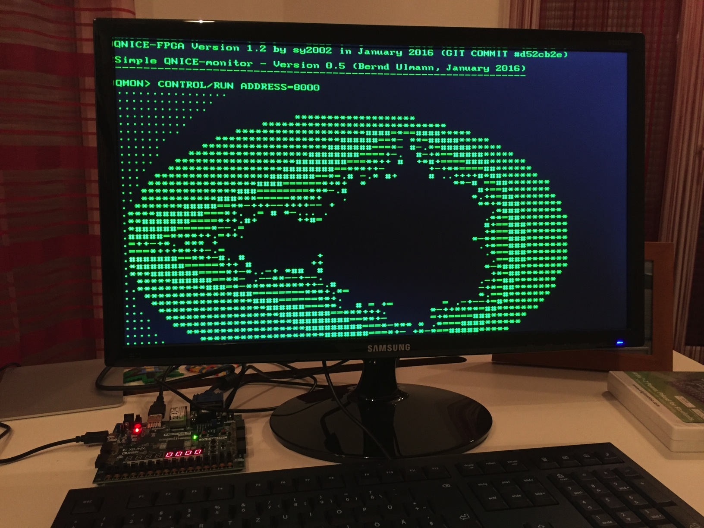

QNICE-FPGA  16-bit System-on-a-Chip
===================================

What is QNICE-FPGA?
-------------------

QNICE-FPGA is a 16-bit computer system build as a fully-fledged
system-on-a-chip in portable VHDL on a FPGA. Specifications:

* 16-bit QNICE CPU featuring 16 registers, 8 of them in 256 register banks
  (learn more in [qnice_intro.pdf](doc/intro/qnice_intro.pdf))
* 32k words ROM (64kB)
* 32k words RAM (64kB)
* UART 115.200 baud, 8-N-1, CTS
* VGA 80x40 character textmode display (640x480 resolution)
* PS/2 keyboard support (mapped to USB on the Nexys4 DDR)
* 4-digit 7-segment display
* 16 hardware toggle switches

The main purpose of QNICE-FPGA is learning, teaching and having fun.

Getting Started
---------------

* Hardware: Currently, we develop QNICE-FPGA on a Nexys 4 DDR development
  board, so if you own one, the fastest way of getting started is to
  download the bitstream file `dist_kit\env1.bit` on the SD card of the
  Nexys board and set the jumpers to read the FPGA configuration from the
  SD card. Attach an "old" USB keyboard supporting boot mode to the board
  and attach a VGA monitor. Attach the Serial-to-USB cable.

* On your host computer: Open a terminal and head to the root folder of the
  QNICE-FPGA GIT repository.

* Compile the assembler and the ROM generator by entering
  `cc assembler/qasm.c -o assembler/qasm` and then
  `cc assembler/qasm2rom.c -o assembler/qasm2rom` 
  on the command line from the root folder of the GIT repository.

* Compile the mandelbrot demo by entering
  `assembler/asm demos/mandel.asm`.

* On OSX, you now have an ASCII file in the clipboard/pasteboard that starts
  with the line `0xA000 0x0F80`. On other operating systems, you might see an
  error message, stating that `pbcopy` is not available. You can savely
  ignore this and manually copy the file `demos/mandel.out` into your
  clipboard/pasteboard.

* Open a serial terminal program, configure it as 115.200 baud, 8-N-1, CTS ON,
  attach the QNICE-FPGA, turn it on, after the bitstream loaded from the SD
  card, connect the terminal program to the serial interface of the FPGA and
  press the reset button. You should see a welcome message and the `QMON>`
  prompt in your terminal program's window.

* Enter `M` then `L` there. You should see something like "Memory/Load".
  Paste the `demos/mandel.out` file to your terminal program's window.
  Press CTRL+E to leave the memory loading routine.

* Enter `C` then `R` and then `A000` in the terminal window. You should
  now see a Mandelbrot output similar to the above-mentioned screenshot in
  your serial terminal window.

* Now set the toggle switches #0 and #1 to '1' (on the Nexys 4 DDR board,
  these are the two rightmost switches). Press the reset button. STDIN/STDOUT
  are now routed from the serial terminal to the PS2/USB keyboard and to
  the VGA screen.

* A reset does not clear the memory, so enter `C` and then `R` and then
  `A000` again. Done! You now should see the same mandelbrot on your
  VGA screen as shown in the above-mentioned screenshot. Use cursor keys
  and page up/down keys to scroll.

More documentation to come.
